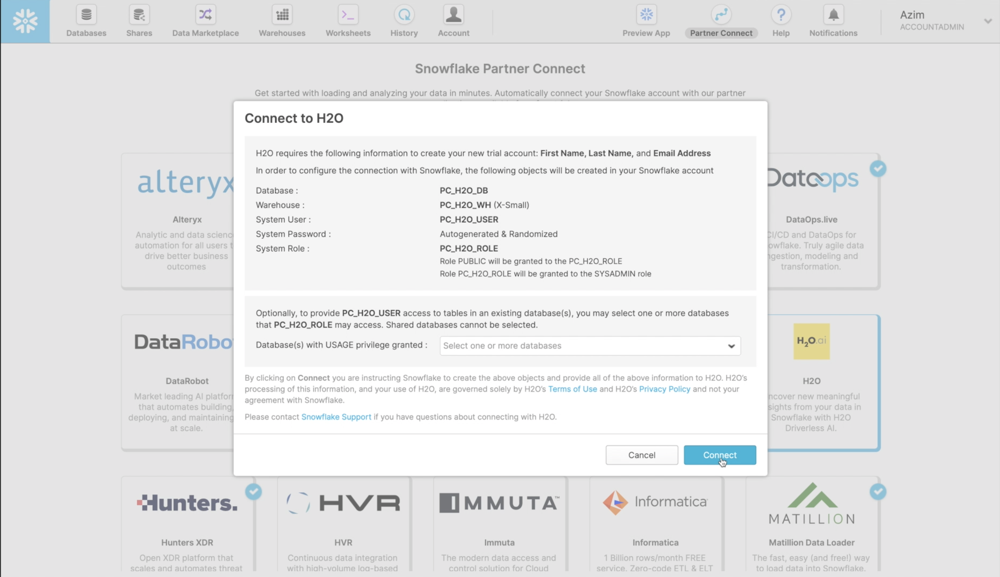
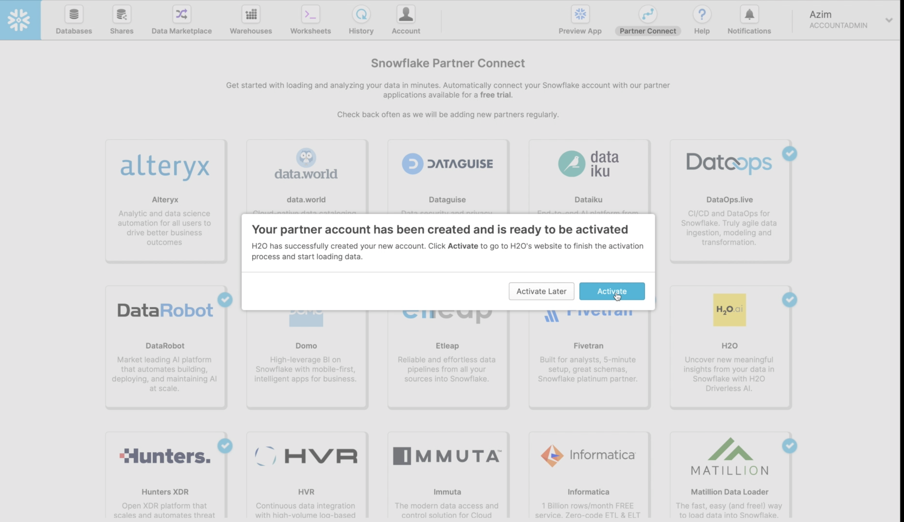
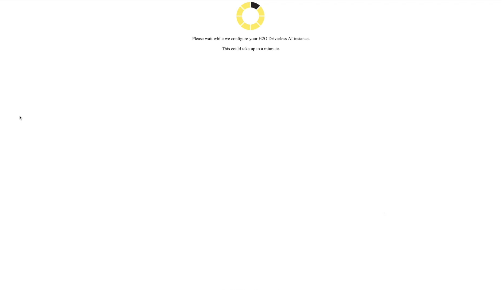

## Step 1: Launching Driverless AI

### Connecting from Snowflake

We assume you are logged into your Snowflake account viewing the Snowflake Partner Connect screen. Connecting to H2O from here is quite simple. First select the H2O link and click `Connect`

This creates a partner account which you can immediately `Activate`

You next need to accept the H2O Terms and Conditions for the Trial Agreement

and wait while your H2O Driverless AI instance is configured and launched.

### Driverless AI Interface

Your brand new Driverless AI instance looks like

A summary of the information and views we cover in this tutorial include

1. H2O.ai information: This displays the version (Driverless AI 1.9.0.2), the license owner and status, and the current user (H2OAI).
2. `DATASETS`: A view for importing, listing, and operating on datasets.
3. `AUTOVIZ`: The Automatic Visualizations of data view.
4. `EXPERIMENTS`: The view where we build and deploy predictive models.
5. `DIAGNOSTICS`: Model diagnostics view.
6. `MLI`: Machine learning interpretability view, information to help us understand our models.
7. `RESOURCES`: A pull-down menu for accessing system information, clients, help, and other resources.

