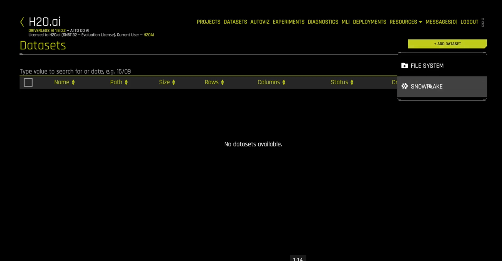
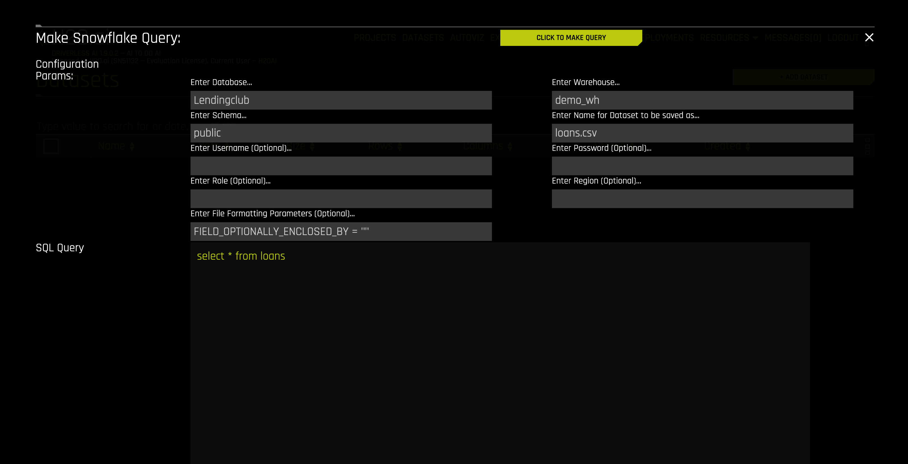
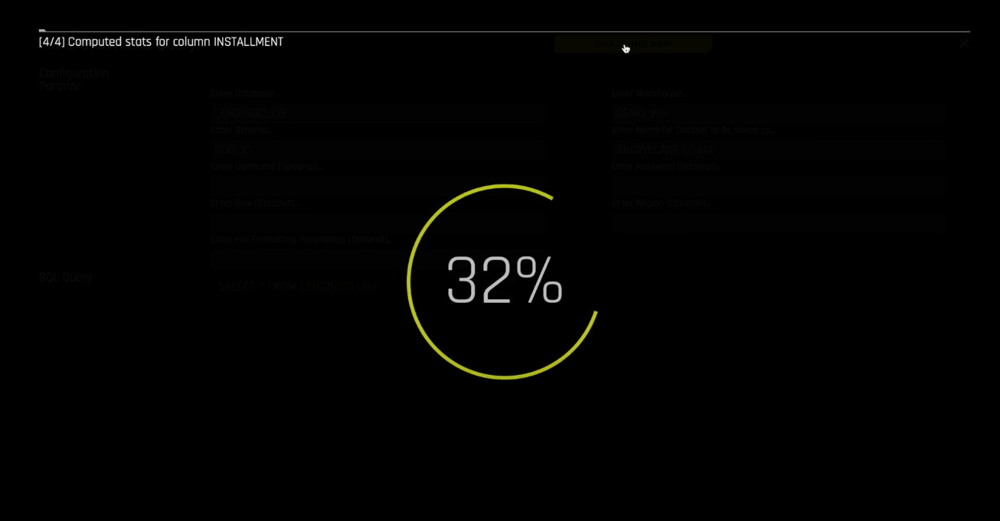
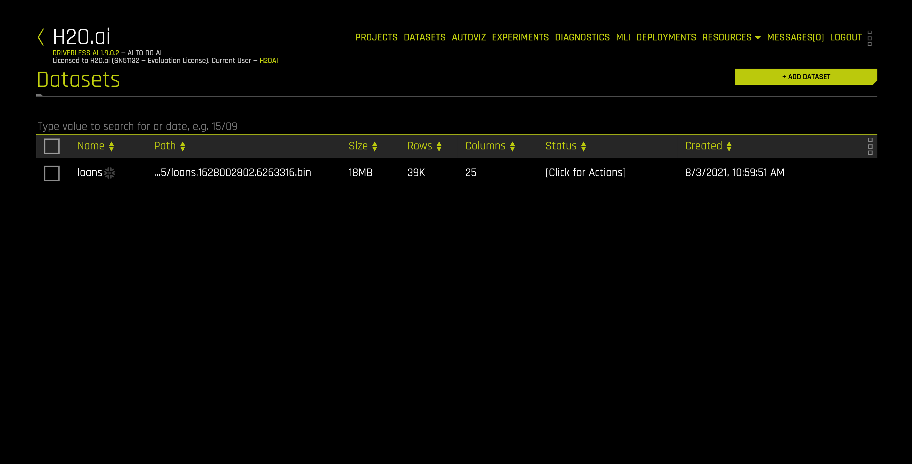

## Step 2: Import Data from Snowflake

From the empty Datasets view, click the `Add Dataset` button and select the `SNOWFLAKE` connector:

This launches the `Make Snowflake Query` form.

Enter into the form

* the Database `Lendingclub`, 
* the Schema as `public`,
* the Warehouse as `demo_wh` (or whatever your Warehouse name is),
* the Name as `loans.csv`,
* the SQL Query `select * from loans`. 

Then click the `CLICK TO MAKE QUERY` button. This imports the data into the Driverless AI system.

The dataset is now available for next steps in Driverless AI

