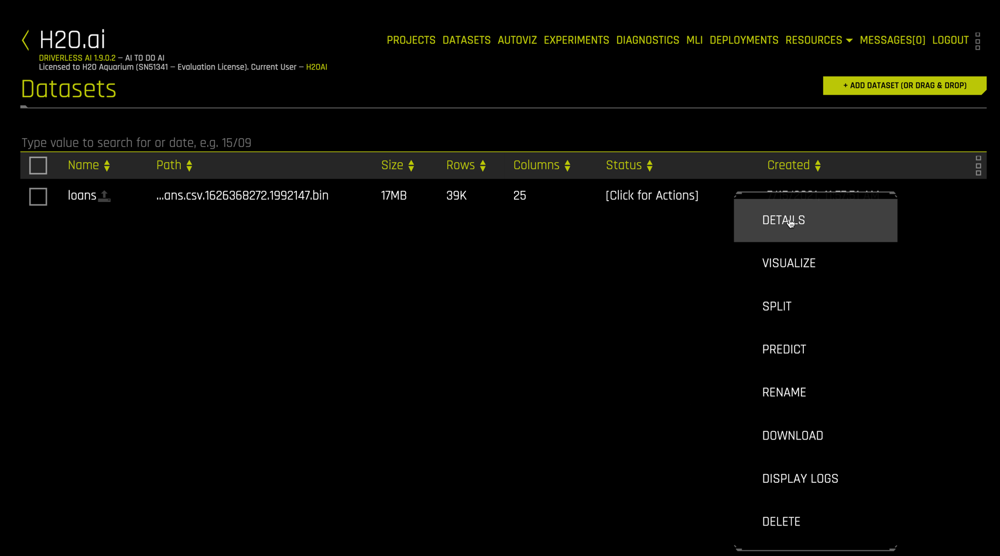

## Step 3: Dataset Details

Right click the `loans` dataset to get details.

The `Dataset Details` view is a quick way to inspect the dataset columns, see their storage type (integer, string, etc.), get summary statistics and distribution plots for each column. 

In more advanced usage, you can edit the data type interactively

Scrolling to the right, inspect the `bad_loans` column, our target variable. 

The target `bad_loans` is Boolean with 38,980 observations and has a mean value of 0.1592. This means that 15.92% of the customers (rows) in this dataset have a loan that was not paid off. 

Clicking the `DATASET ROWS` button on the upper right yields a spreadsheet format.

This is helpful in understanding the layout of the data. A quick inspection of your dataset using `Details` is a good practice that we always recommended.
