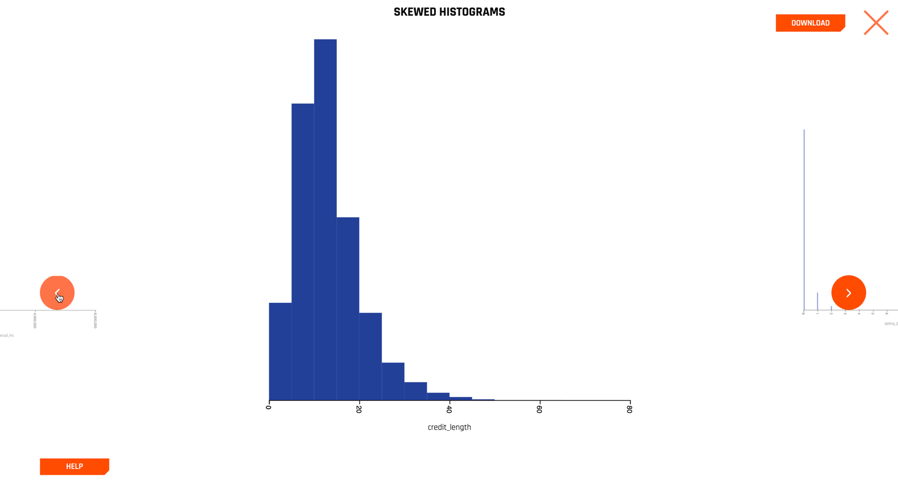
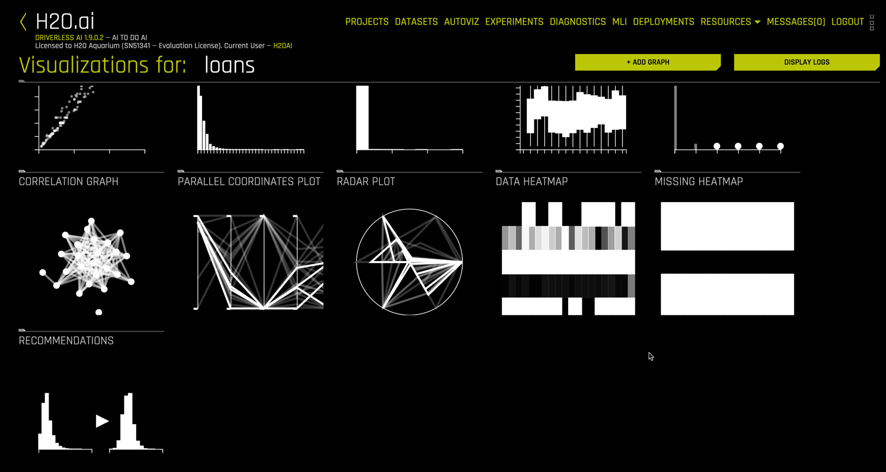

## Step 4: Automatically Visualizing Datasets

`Autoviz` in Driverless AI automatically creates a variety of classical and interactive graphs that are useful for understanding the data to be used in building a model for prediction. `Autoviz` is unique in that it only shows the graphs that are applicable based on the information in your data.

Right click the dataset name and select `VISUALIZE` to launch AutoViz

The available visualizations for the `loans` data are shown below.

Selecting the `SKEWED HISTOGRAMS` section, for example, yields a series of histograms on only the columns that are sufficiently skewed. We show one below for the `credit_length` column. 

Clicking the left and right navigation arrows allows you to inspect additional variables, ordered by their skewness.

Close the `SKEWED HISTOGRAMS` display and scroll down to see `RECOMMENDATIONS`.

Selecting `RECOMMENDATIONS` produces

The philosophy underlying the automatic visualizations is to make it easy for the data scientist to quickly understand their data fields, but it does not make decisions for the data scientist. 

There are a number of additional useful graphs that can be navigated to fully understand your data prior to modeling. 

