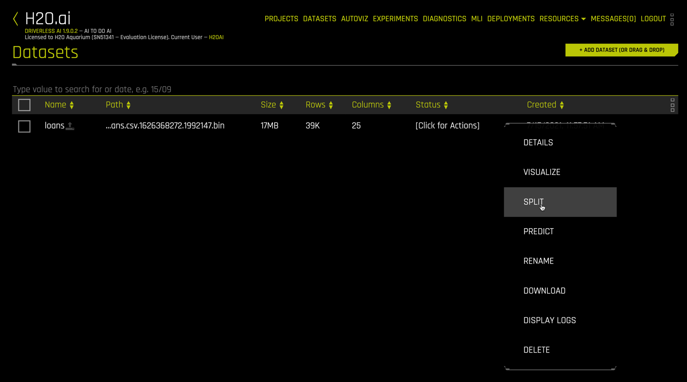

## Step 5: Split Data

Splitting data into train and test sets allows models to be built with the train set and evaluated on the test data. This protects against overfit and yields more accurate error estimates. To use the Dataset Splitter utility, right click the dataset and select `SPLIT`

Name your `train` and `test` splits, then select a split ratio (here we use 0.8).

For a time series use case, enter the time column. If your data have predefined folds for k-fold cross validation, enter the fold column. A seed is available for reproducibility. Select the target column `bad_loan`

The data type of the target column determines the splitting algorithm. For classification problems, stratefied random sampling is used. For numeric target columns, simple random sampling is used.

Click `SAVE` to create the datasets.

The `train` dataset has around 31,000 rows and the `test` dataset around 8000 rows.

