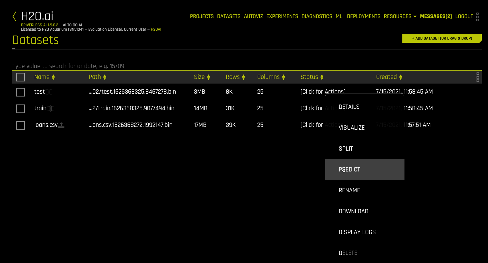
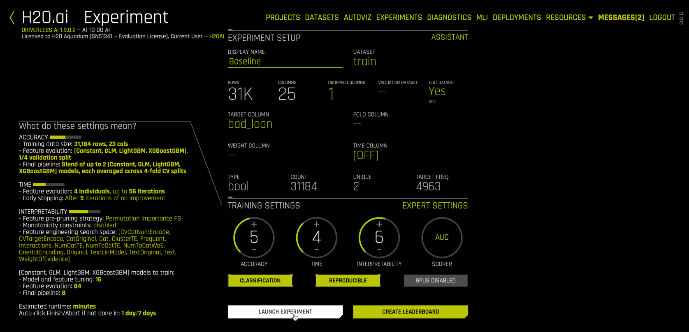
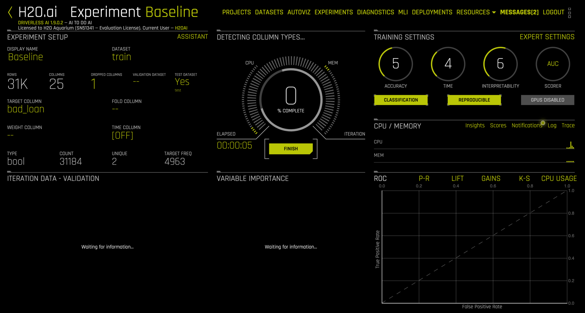
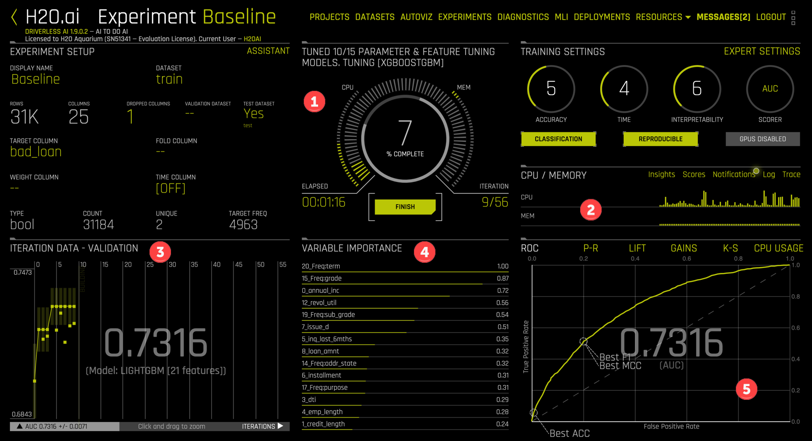
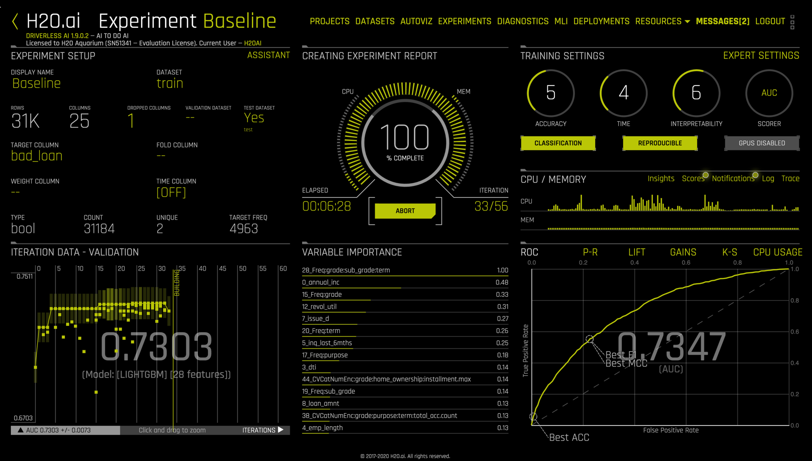
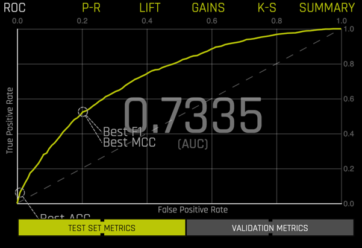
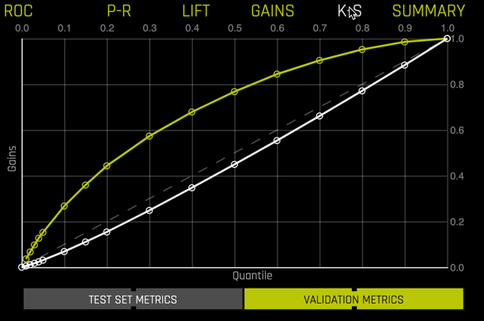

## Step 6: Experiment

We use the term _Experiment_ in Driverless AI to refer to the entire feature engineering and model evolution process. Instead of fitting one model, we are fitting many and using a "survival of the fittest" approach to optimize features and model hyperparameters. The result is a combination feature engineering-modeling _pipeline_, which can easily be investigated and promoted into production.

### 6.1 Set up an Experiment

We start an experiment from the `Datasets` view by clicking on the line corresponding to the `train` dataset and selecting `PREDICT` from the dropdown menu

This opens the following form for configuring an experiment.

The fields are

1. (Optional) Name your experiment. This is especially helpful for leaderboards in `Projects`.
2. The prefilled training dataset.
3. (Optional) Select columns to drop from modeling.
4. (Optional) Select a validation dataset. Setting this option will enforce a train-validate split throughout the experiment.
5. (Recommended) Select the test dataset. You should **always** have a holdout test dataset to evaluate your model!
6. Select the target column. This option is flashing so you will not miss it.
7. (Optional) Select a column containing fold numbers. This is used where folds for k-fold cross validation have already been defined.
8. (Optional) Select weight column.
9. (Optional) Select a time column. This switches Driverless AI into a time-series mode, where specialized data, feature engineering, and model settings are enabled.

For our experiment, enter "Baseline" as the display name (#1). Next select the `TEST DATASET` file `test` (#5). The `desc` column contains a written explanation from the customer describing the reason for requesting a loan. Although Driverless AI has extensive NLP (natural language processing) capabilities, we omit them in this baseline model. Thus using `DROPPED COLUMNS` (#3), select `desc`:

Next select `bad_loan` as the `TARGET COLUMN` (#6). You will have to scroll down, since `bad_loan` is the next-to-last variable in the dataset

After selecting the target variable, Driverless AI analyzes the data and experimental settings and prefills additional options:  

These include

1. Target variable status
2. The `ACCURACY/TIME/INTERPRETABILITY` dials which range from 1 to 10 and largely determine the recipe for the experiment. 
3. The `CLASSIFICATION/REPRODUCIBLE/GPUS DISABLED` clickable buttons.
4. The `SCORER` used in model building and evaluation.
5. `EXPERT SETTINGS` for fine control over a vast number of system, model, feature, recipe, and specialty options.  
6. A detailed settings description.
7. `LAUNCH EXPERIMENT` to run the experiment defined by dial settings, scorer, and expert settings.

For our experiment, 

* The target variable is `bool` (Boolean) with 31,184 observations, 4963 of which are equal to 1 (#1). The `CLASSIFICATION` button (#3) is enabled by default because the target is Boolean.
* The `ACCURACY` dial is set to 5. Higher values of accuracy are more computationally intensive. The description under (#6) shows that `ACCURACY` impacts how features are evaluated (model & validation strategy) and what form the final pipeline will take (individual models vs. ensembles and validation strategy).
* The `TIME` dial is set to 4. Higher values of `TIME` allow for longer feature evolution. `TIME` levels also include early stopping rules for efficiency.
* Note: Higher values of `ACCURACY` and `TIME` do not always lead to better predictive models. Model performance should always be evaluated using a holdout test data set.
* The `INTERPRETABILITY` dial ranges from 1 (least interpretable = most complex) to 10 (most interpretable = least complex). `INTERPRETABILITY` set to 7 or higher enable monotonicity constraints, which significantly increases model understanding.

Click on the `REPRODUCIBLE` button to enable reproducibility. This may be important for regulatory reasons or, as in our case, for educational purposes. Also select AUC as the scorer (#4)

Clicking on `EXPERT SETTINGS` (#5) exposes an immense array of options and settings

This gives the expert data scientist complete control over the Driverless AI experience, including the ability to customize models, feature transformers, scorers, and data using `CUSTOM RECIPES`. Select `CANCEL` to exit out of the expert settings screen.

### 6.2 Run Experiment

Before launching the experiment, your settings should look like the following.

Click `LAUNCH EXPERIMENT` to commence.
The Driverless AI UI now includes a descriptive rotating dial in the center with live monitoring displays for model evolution, variable importance, resource usage, and model evaluation.

To get more detailed resource monitoring, go to `RESOURCES` in the menu and select `SYSTEM INFO`. 

The `System Info` view shows hardware usage and live activity monitoring of individual CPU cores.

Clicking `CLOSE` sends us back to the running `Experiment Baseline` view. 

Note that

1. The central dial shows 7% completion after 1:06 with 9/56 planned iterations completed.
2. The CPU and memory usage monitor is a simplified version of the `System Info` view we just closed.
3. Each dot in the `ITERATION` monitor corresponds to an individual model. The last model evaluated is a LightGBM model with 21 features and an AUC of 0.7316. Moving your mouse over any of the model dots will highlight that model and summary information.
4. The `VARIABLE IMPORTANCE` display shows the features of the latest model (or the model selected in the `ITERATION DATA` display) and their relative importance.
5. By default, the ROC curve for the selected model and AUC are displayed, but other displays are available: P-R (Precision Recall), Lift, Gains, and K-S (Kolmogorov-Smirnov).

#### Notifications

Selecting `Notifications` in the `CPU/MEMORY` section (2) opens important information and discoveries from Driverless AI.

Ours reports that 

* Reproducible mode was enabled, along with its implications.
* Imbalanced data was detected but imbalanced settings were not enabled. Notifications then indicates the expert settings required to account for imbalance in the data.
* An ID column was identified and automatically dropped from data.
* Additional information on scoring during feature and model tuning.

Notification are important to read and understand. The advice in notifications often leads to better models.

#### Technical logs

The technical data scientist might consider selecting `Log` in the `CPU/MEMORY` section. Driverless AI logs its entire process in great detail. Clicking `Log` opens a system logging window for monitoring live. Logs can be downloaded during or after the experiment.

Nearing the conclusion of the experiment

we see that the dial is at 100% complete, the elapsed time is approximately 6:30 (while results are reproducible, times are not themselves exactly reproducible), and the experiment is stopping early, needing only 33 of 56 iterations.

### 6.3 Completed Experiment

Upon completion, the `Experiment Baseline` view replaces the spinning dial in the center with a stack of clickable bars

#### Summary 

The lower right panel includes an experiment summary, zoomed in below:

The summary contains information about the experiment settings, its seed, the train, validation, and test data, system (hardware) specifications, features created, models created, timing, and scores. In particular, note that 

* 230 features were created but only 28 were used,
* feature evolution used 35 models,
* feature tuning used 16 models,
* final pipeline training used an additional 8 models.

Importantly, the MOJO latency timing of 0.13 milliseconds indicates the speed of scoring this model in production.

#### Model Performance

Selecting ROC in the lower right replaces the summary with the ROC curve.

You can toggle between `VALIDATION METRICS` and `TEST SET METRICS` for this display.

Selecting any point along the curve produces a confusion matrix with additional peformance metrics

You can view other model performance metrics, including Precision-Recall

Lift chart

Gains chart

and Kolmogorov-Smirnov 

