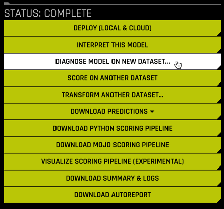
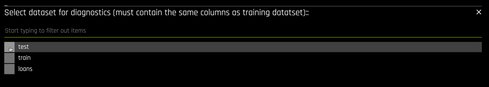
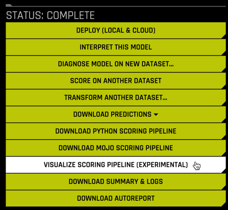

## Step 7: Experiment Inspection

Once an experiment is completed, it is important to understand the final model's predictive performance, its features, parameters, and how the features and model combine to make a pipeline. 

### 7.1 Diagnostics

The `DIAGNOSE MODEL ON NEW DATASET ...` button is used to create extensive diagnostics for a model built in Driverless AI. After clicking the button,

select the dataset used for diagnostics, we will use the `test` dataset. 

The `Diagnostics` view that is returned is very complete. You can choose from a plethora of `Scores` on the left. And each of the `Metric Plots` on the right is interactive. 

Selecting the confusion matrix plot yields

Likewise, the interactive ROC curve produces

### 7.2 AutoReport

By default, an automated report is created for each experiment that is run. Download the `AutoReport` by
 

The document that is created is a very thorough summary of the experiment, documenting in detail the data, settings, and methodologies used to create the final pipeline.

This includes detailed information on the features that were engineered and the process for engineering them.

It also contains validation and test metrics and plots.

For this particular experiment, the AutoReport is a 36-page technically detailed document.

### 7.3 Pipeline Visualization

Selecting the `VISUALIZE SCORING PIPELINE` button

returns a visual representation of the pipeline

This pipeline is also available in the AutoReport, along with explanatory notes copied below. The pipeline consists of 

* 28 total features, both original and engineered.
* Two LightGBM models created with 4-fold cross validation each.
* A stacked ensemble blending the two LightGBM models.
* The output are probabilities for `bad_loan = False` and `bad_loan = True`.

