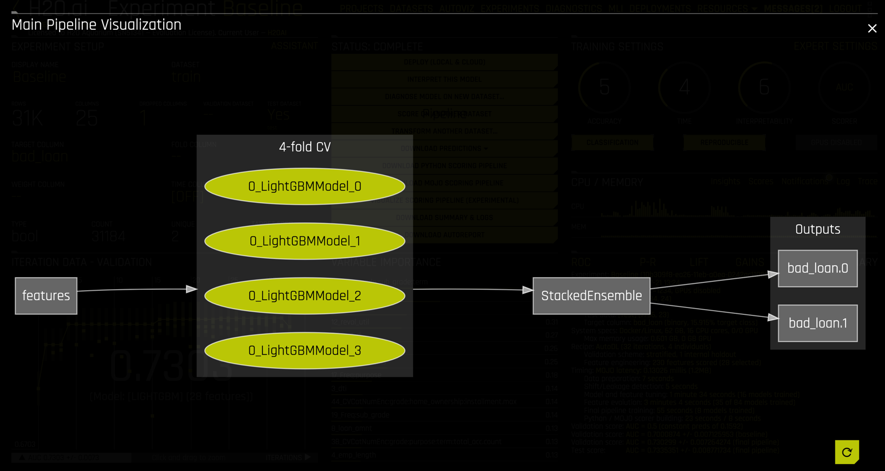

## Step 7: Experiment Inspection

### 7.1 Diagnostics

### 7.2 AutoReport

The AutoReport that is created is a document

This document has complete information on ...

And some more stuff ...

### 7.3 Pipeline Visualization

### 7.4 Logs

