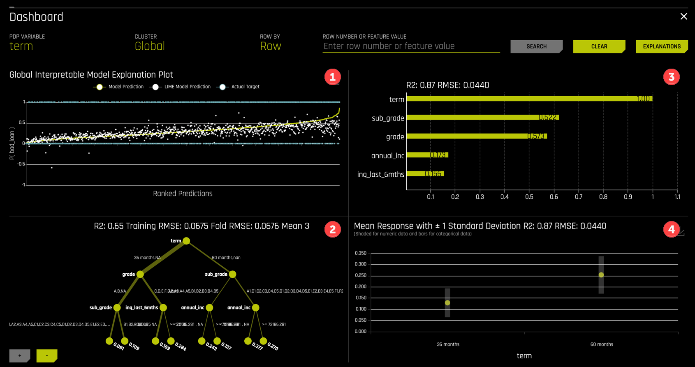
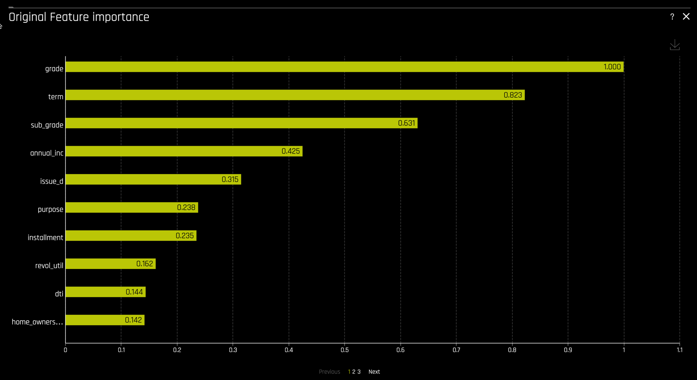

## Step 8: Machine Learning Interpretability (MLI)

One of Driverless AI's most important features is the implementation of a host of cutting-edge techniques and methodologies for interpreting and explaining the results of black-box models. In this tutorial, we just highlight some of the MLI features available in Driverless AI without discussing their theoretical underpinnings.

To launch MLI from a completed experiment, select the `INTERPRET THIS MODEL` button

The MLI view allows easy navigation through the various interactive plots.

### Dashboard

The `Dashboard` view displays four useful summary plots 

1. A K-LIME (Local Interpretable Model-agnostic Explanations) surrogate model.
2. A Decision Tree surrogate model.
3. A feature importance plot.
4. A PDP (Partial Dependence Plot).

Each of these plots are available in a larger format from the main MLI view.

### Feature Importance

Other plots include Feature importance on the transformed features

and on the original features

### Shapley

Shapley values are also available for the transformed and original features

### Additional Capabilities

The MLI view provides tools for disparate impact analysis and sensitivity analysis, also called "What If" analysis.

