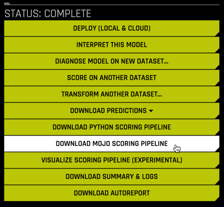
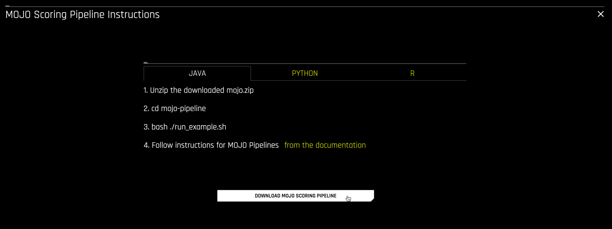

## Step 9: Deploy the model using Java UDFs 


### Introduction

The final model from a Driverless AI experiment can be exported as either a **MOJO scoring pipeline** or a **Python scoring pipeline**. The MOJO scoring pipeline comes with a `pipeline.mojo` file that can be deployed in any environment that supports Java or C++. There are a myriad of different deployment scenarios for Real-time, Batch or Stream scoring with the `pipeline.mojo` file. In this tutorial, we deploy the final model as a Snowflake Java UDF.  

### Gather Driverless AI artifacts

We need to collect the following components from Driverless AI:

- `pipeline.mojo`
- `mojo2-runtime.jar`
- `H2oDaiScore.jar`
- A valid Driverless AI license file

The first two files we will download from Driverless AI directly. Select `DOWNLOAD MOJO SCORING PIPELINE`



and then `DOWNLOAD MOJO SCORING PIPELINE` again from the Instructions screen



This downloads a file `mojo.zip` which contains the `pipeline.mojo` and `mojo2-runtime.jar` files.  For convenience, we have also made the `pipeline.mojo` file available here:

<button>
  [Download pipeline.mojo file](https://snowflake-workshop-lab.s3.amazonaws.com/h2o/pipeline.mojo)
</button>


The next file, `H2oDaiScore`, is a custom scorer developed by H2O.ai to deploy MOJOs using Snowflake Java UDFs. It can be downloaded from H2O here: [https://s3.amazonaws.com/artifacts.h2o.ai/releases/ai/h2o/dai-snowflake-integration/java-udf/download/index.html](https://s3.amazonaws.com/artifacts.h2o.ai/releases/ai/h2o/dai-snowflake-integration/java-udf/download/index.html). Select the latest release (0.0.3 at the time of this writing). Extract the downloaded `H2oScore-0.0.3.tgz` file to find `H2oDaiScore-0.0.3.jar`.

Include your Driverless AI license file `license.sig` as well. **_{Instructions on getting Driverless AI license?}_**


### Setup Snowflake
We start by creating a Snowflake stage and granting appropriate privileges  

**[Snowflake to fill in here?]**

``` sql


```

Next we copy the artifacts to the Snowflake stage we just created

``` sql
put file://pipeline.mojo @java_udf_stage/h2oScorePackages/;
put file://mojo2-runtime.jar @java_udf_stage/h2oScorePackages/;
put file://H2oDaiScore-0.0.3.jar @java_udf_stage/h2oScorePackages/;
put file://license.sig @java_udf_stage/h2oScorePackages/;
```

#### Create a Java UDF in Snowflake

Execute a `CREATE FUNCTION` statement and provide:

- a name for the function and its parameters,
- the location in the stage of `pipeline.mojo` and all other artifacts,
- the Java method to be invoked when the Java UDF is called.

For example,

``` sql
CREATE FUNCTION H2OScore_Java(params STRING, rowData ARRAY)
    
    returns variant language java
    
    imports = ('@java_udf_stage/h2oScorePackages/pipeline.mojo',
               '@java_udf_stage/h2oScorePackages/license.sig',
               '@java_udf_stage/h2oScorePackages/mojo2-runtime.jar',
               '@java_udf_stage/h2oScorePackages/H2oDaiScore-0.0.3.jar'
               )
    
    handler = 'h2oScorePackages.H2oDaiScore.h2oDaiScore';
```


### Make predictions using the Java UDF

The syntax for calling a Java UDF in Snowflake is

``` sql
SELECT <JAVA_UDF_FUNCTION_NAME>(<JAVA_UDF_FUNCTION_PARAMS>) FROM <TABLE_NAME>;
```

Using the `H2OScore_Java` UDF defined above, we score a table `loans` using `pipeline.mojo` as follows:

``` sql
SELECT 
    ID, 
    H2OScore_Java(
        'Modelname=pipeline.mojo', 
        ARRAY_CONSTRUCT(loan_amnt, term, installment, grade, sub_grade, emp_length, 
                        home_ownership, annual_inc, verification_status, issue_d, 
                        purpose, addr_state, dti, inq_last_6mths, open_acc, 
                        revol_util, total_acc, credit_length)
    ) AS H2OScore
FROM loans;
```

> Scored 38,980 rows in 7s

The results should look like this

**Results Preview** (first 3 rows)

| Row      | ID | H2OScore |
| ----------- | ----------- | ----------- |
| 1      | 1077501       |0.8469023406505585
| 2   | 1077430        |0.5798575133085251
| 3   | 1077175        |0.5994115248322487


### Easy Deployment using AutoGen

A Snowflake Worksheet template to deploy and score DAI MOJOs using Java UDFs can be automatically generated using the H2O REST Server deployment:

``` sh
curl "<ip>:<port>/autogen?name=<model_name>&notebook=snowflake.udf"
```

For example,

```sh
curl "http://127.0.0.1:8080/autogen?name=pipeline.mojo&notebook=snowflake.udf" 
```


